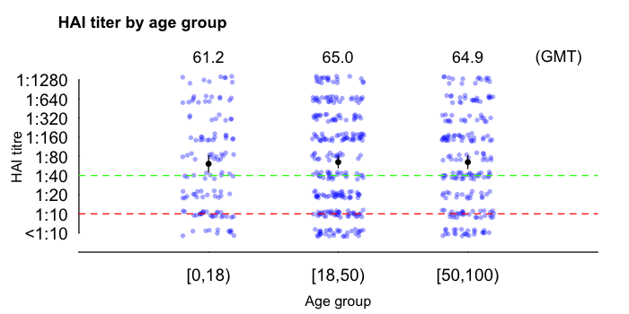
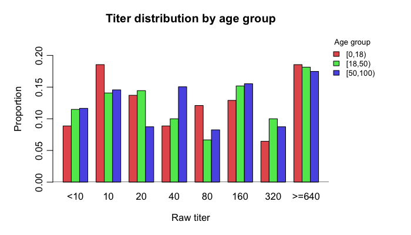
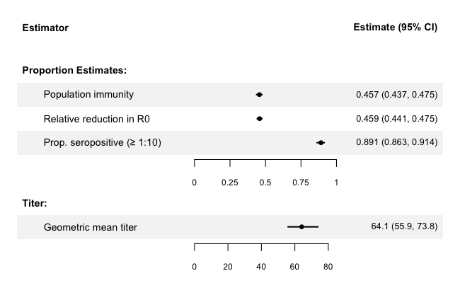
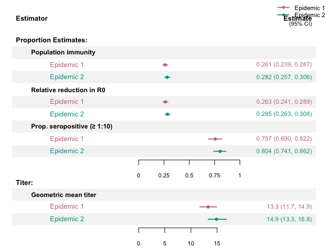
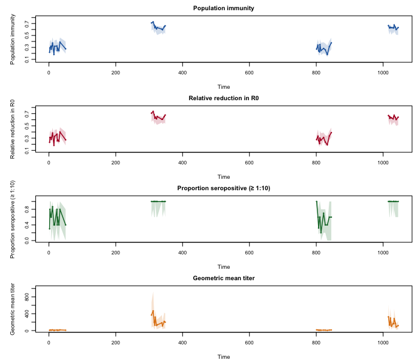

<!-- This README is maintained directly. Do not regenerate from README.Rmd. -->

# ImmuPop

<!-- badges: start -->
[](https://www.repostatus.org/#active)
<!-- badges: end -->

**ImmuPop** estimates population immunity from individual serology data using a Bayesian simulation framework. Given individual antibody titers, age-specific protection curves, population age structure, and a contact matrix, it produces four key metrics: geometric mean titer (GMT), proportion seropositive, population immunity, and relative reduction in R0. The MCMC backend uses MCMCpack for Dirichlet-multinomial sampling of titer distributions.

## Features

- **Four immunity estimators** — GMT, proportion seropositive (titer >= 10), population immunity, and relative reduction in R0
- **Three estimation modes** — single time point (`ImmuPop_est_timepoint`), time series (`ImmuPop_est_timeseries`), and pre-epidemic baseline by epidemic group (`ImmuPop_est_baseline`)
- **Age-structured framework** — age-specific protection curves, population proportions, and contact matrices
- **Publication-ready plots** — titer jitter plots with GMT/CI, titer distributions, immunity dot-and-whisker charts, baseline comparisons
- **Flexible age grouping** — user-defined age cuts via `generate_data()`
- **Reproducible** — optional `seed` parameter on all estimation functions

## Installation

```r
# install.packages("devtools")
devtools::install_github("timktsang/ImmuPop")
```

## Quick start

```r
library(ImmuPop)
data("ImmuPop_raw_data")

# Prepare data with age groups
df <- generate_data(ImmuPop_raw_data, cut_age = c(0, 18, 50, 100))

# Define population parameters
age_prop       <- c(0.2, 0.4, 0.4)
contact_matrix <- matrix(c(22, 16, 15, 24, 28, 30, 18, 32, 35),
                         nrow = 3, byrow = TRUE)
protect_c      <- c(0.1, 0.2, 0.3, 0.5, 0.55, 0.6, 0.65, 0.7, 0.75, 0.8)
protect_a      <- c(0.1, 0.2, 0.3, 0.5, 0.55, 0.6, 0.65, 0.7, 0.75, 0.8)

# Estimate immunity at a single time point
data_t <- df[df$time == 2, ]
result <- ImmuPop_est_timepoint(data_t, protect_c, protect_a,
                            age_prop, contact_matrix,
                            sim_num = 500, seed = 42)
result
#>   estimator     value    CI_lwr    CI_upr
#> 1 pop_immun 0.2629421 0.2402498 0.2883498
#> 2     RR_R0 0.2610716 0.2427685 0.2843558
#> 3       GMT 13.389836 11.899416 14.627662
#> 4    prop_5 0.7605634 0.7091408 0.8164179
```

## Visualization

### Titer jitter plot (by age group)

Replicates the standard HAI titer-by-age plot used in influenza seroprevalence publications. Individual titers shown as jittered points, with GMT (black dot) and 95% CI. Dashed lines mark seropositive (red, 1:10) and seroprotection (green, 1:40) thresholds.

```r
plot_titer_jitter(df, main = "HAI titer by age group", seed = 42)
```



For multi-panel layouts (e.g. one panel per antigen), use `par(mfrow)` and call once per panel:

```r
par(mfrow = c(3, 1))
plot_titer_jitter(df_antigen1, main = "A. Antigen 1", seed = 42)
plot_titer_jitter(df_antigen2, main = "B. Antigen 2", seed = 42)
plot_titer_jitter(df_antigen3, main = "C. Antigen 3", seed = 42)
```

### Titer distribution

```r
plot_titer_dist(df, main = "Titer distribution by age group")
```



### Immunity estimates (single time point)

Estimate population immunity from a single survey round — e.g. a cross-sectional serosurvey at one point in time. This gives a snapshot of how immune the population is right now.

```r
data_t <- df[df$time == 2, ]
result <- ImmuPop_est_timepoint(data_t, protect_c, protect_a,
                            age_prop, contact_matrix,
                            sim_num = 500, seed = 42)
plot_estimates(result)
```



### Baseline comparison across epidemics

Compare pre-epidemic immunity across multiple epidemic waves — e.g. to assess whether the population started each flu season with different levels of protection. `ImmuPop_est_baseline()` runs the same estimation separately for each epidemic group, so you can see how starting immunity changed from one wave to the next.

```r
df_bl  <- df[df$baseline == "yes", ]
res_bl <- ImmuPop_est_baseline(df_bl, protect_c, protect_a,
                           age_prop, contact_matrix,
                           sim_num = 500, seed = 42)
plot_estimates(res_bl)
```



### Timeseries

Track how population immunity evolves over time across multiple survey rounds. For time series results (many time points), `plot_estimates()` automatically switches to a multi-panel line plot with 95% CI ribbon. Gaps between survey rounds are detected and drawn as separate segments.

```r
res_ts <- ImmuPop_est_timeseries(df, protect_c, protect_a,
                                  age_prop, contact_matrix,
                                  sim_num = 500, seed = 42)
plot_estimates(res_ts)
```



## Estimation modes

| Function | Use case | Input | Groups by |
|----------|----------|-------|-----------|
| `ImmuPop_est_timepoint()` | Snapshot from one survey round | Single time point subset | — (ungrouped) |
| `ImmuPop_est_baseline()` | Compare pre-epidemic immunity across waves | Baseline samples (`baseline == "yes"`) | Epidemic (`epi`) |
| `ImmuPop_est_timeseries()` | Track immunity over time | Full longitudinal data | Time point (`time`) |

All three return a data frame with columns `estimator`, `value`, `CI_lwr`, `CI_upr` (plus `epi` or `time` for grouped modes), and all work with `plot_estimates()`.

## Input data format

The input data frame must contain these columns:

| Column | Description |
|--------|-------------|
| `uid` | Individual identifier |
| `baseline` | Baseline indicator (`"yes"` / `"no"`) |
| `epi` | Epidemic identifier (integer) |
| `age` | Age in years |
| `time` | Time point identifier |
| `raw_titer` | HAI titer value (e.g. 5, 10, 20, 40, ...) |

Use `generate_data(raw_data, cut_age = c(0, 18, 50, 100))` to add age group and titer level columns.

## Population parameters

| Parameter | Description |
|-----------|-------------|
| `protect_c` | Protection probability at each titer level for children |
| `protect_a` | Protection probability at each titer level for adults |
| `age_prop` | Population proportion in each age group (must sum to 1) |
| `contact_matrix` | Square contact matrix (rows/cols = age groups) |

Contact matrices can be generated using the [socialmixr](https://cran.r-project.org/package=socialmixr) package.

## Citation

Xiong W, et al. A Framework for Measuring Population Immunity Against Influenza Using Individual Antibody Titers. *(in preparation)*

## Development

Code development assisted by AI tools (Claude, Anthropic; Codex, OpenAI).
